# How to install ownCloud 10 server on RHEL 7

ownCloud is a Dropbox-like solution for self-hosted file sharing and syncing. Installing ownCloud 10 on RHEL is quite simple, however, the OwnCloud documentation does not cover it completly (it's more focused on Debian like versions) hence this document. 

This article covers the installation of the server (not the client).

## What is ownCloud?
ownCloud is a web suite that provides cloud storage over the network. Data will be stored on the server and can be downloaded or accessed anytime with a browser or desktop client or smartphone app.

##ownCloud Server Installation

The server is the core software behind ownCloud. Supporting Linux (like) operating systems it takes care of all your files and data and controls the access.

ownCloud is based on PHP and an SQLite, MySQL, Oracle or PostgreSQL database, so it can run on all platforms that meet these requirements. It provides almost all possibility of functions that are available in commercial suites.

ownCloud is released under an AGPLv3 license, so you can setup own cloud storage server without any additional cost. The commercial version of ownCloud is also available.

### Step 1: Prerequisites

First, you have to enable Redhat software collection repository on RHEL 7.

~~~~
subscription-manager repos --enable rhel-server-rhscl-7-eus-rpms
~~~~

ownCloud works only with PHP v5.6 and above (RHEL 7 ships 5.4 by the moment of this writing). So, you need to configure Webtatic repository on RHEL to get PHP 5.6 packages (in the case of this guide, php 7.0 is to be used).

Also, you need to enable EPEL repository to get dependent packages.

~~~~
rpm -ivh https://dl.fedoraproject.org/pub/epel/epel-release-latest-7.noarch.rpm
rpm -ivh https://mirror.webtatic.com/yum/el7/webtatic-release.rpm
[root@ansible-master ~]# yum install epel-release
~~~~

### Step 2: Apache and PHP Installation

Now you are able to install the Apache server and PHP extensions simply using the yum command.

NOTE: To install php 7.0 from  Red Hat Software Collections and configure Apache accordingly, I highly recommend following the steps described in the [KCS 2662201](https://access.redhat.com/solutions/2662201). As per the document, I am using Apache 2.4

~~~~
yum install httpd24 httpd24-mod_ssl
~~~~

And now, all the php modules needed:

~~~~
[root@ansible-master ~]# yum install rh-php70-php-common.x86_64 rh-php70-php-json.x86_64 rh-php70-php-xml.x86_64 rh-php70-php-zip.x86_64 rh-php70-php-mbstring.x86_64 rh-php70-php-pdo.x86_64 rh-php70-php-gd.x86_64 rh-php70-php-intl.x86_64 rh-php70-php-mysqlnd.x86_64 rh-php70-php-opcache.x86_64 rh-php70-php
~~~~

### Step 3: Database Installation

ownCloud is based on PHP and a database combination. Database can be any of from SQLite, MySQL/MariaDB, Oracle or PostgreSQL database.

For this document, I have chosedn MariaDB/MySQL as a database for ownCloud.

SQLite is good for testing ownCloud, as well as small, single-user, ownCloud servers. But, it does not scale for large, multi-user sites.

~~~~
[root@ansible-master ~]# yum -y install wget mariadb-server mariadb
~~~~

### Step 4: ownCloud Installation

ownCloud provides a variety of options (Tarball, Docker, Appliance, Linux Packages, and Web Installer) to run ownCloud in your environment.

Here, I am using Linux installer for the installation of ownCloud, from the available repos, as I think it's the easiest way to accomplish it. 

First import the ownCloud sigining key using the rpm command.

~~~~
[root@ansible-master config]# rpm --import https://download.owncloud.org/download/repositories/production/RHEL_7/repodata/repomd.xml.key
~~~~

And then, the ownCloud repository from the ownCloud site, followed by the installation using yum as follows:

~~~~
[root@ansible-master ~]# curl https://download.owncloud.org/download/repositories/10.0/RHEL_7/ce:10.0.repo | tee /etc/yum.repos.d/owncloud_CE:10.0.repo
[root@ansible-master ~]# yum install owncloud
~~~~

### Step 5: Services Configuration
#### ownCloud

First of all, you need to allow the web server to read and write the files on ownCloud directory (otherwise, it will simply not work).

~~~~
chown -R apache.apache /var/www/html/owncloud/
~~~~

Now, it's time to start the services and enable them to run automatically at system start-up. Our services are Apache and Maria DB:

~~~~
[root@ansible-master ~]# systemctl start httpd24-httpd
[root@ansible-master ~]# systemctl start mariadb

[root@ansible-master ~]# systemctl enable httpd24-httpd
[root@ansible-master ~]# systemctl enable mariadb
~~~~

**NOTE:** Since I am using Apache 2.4, the configuration file used is now `/opt/rh/httpd24/root/etc/httpd/conf/httpd.conf`.

#### Web server, Apache 2.4
On Debian, Ubuntu, and their derivatives, Apache installs with a useful configuration, so all you have to do is create a /etc/apache2/sites-available/owncloud.conf, however this is not the case of RHEL.

In this particular document, I have decided to add a "Directory" directive as per the documentation, to the general Apache configuration file (even it can also be done in a separate file):

~~~~
vi /opt/rh/httpd24/root/etc/httpd/conf/httpd.conf
[...]

</Directory>

Alias /owncloud "/var/www/html/owncloud/"

<Directory /var/www/html/owncloud/>
  Options +FollowSymlinks
  Require all granted
  AllowOverride All

 <IfModule mod_dav.c>
  Dav off
 </IfModule>

 SetEnv HOME /var/www/html/owncloud
 SetEnv HTTP_HOME /var/www/html/owncloud

</Directory>
~~~~

#### Database

In my case, I am setting up a MariaDB for the first time, so I need to run the mysql_secure_installation to Secure MariaDB / MySQL. MariaDB server must be started before creating the database.

If you already have a MariaDB installation, you can skip this step.

NOTE: I am adding all the screen output here so you know all the options, this is the moment in which you define a new password for the admin database user.

~~~~
[root@ansible-master ~]# mysql_secure_installation

NOTE: RUNNING ALL PARTS OF THIS SCRIPT IS RECOMMENDED FOR ALL MariaDB
      SERVERS IN PRODUCTION USE!  PLEASE READ EACH STEP CAREFULLY!

In order to log into MariaDB to secure it, we'll need the current
password for the root user.  If you've just installed MariaDB, and
you haven't set the root password yet, the password will be blank,
so you should just press enter here.

Enter current password for root (enter for none):
OK, successfully used password, moving on...

Setting the root password ensures that nobody can log into the MariaDB
root user without the proper authorisation.

Set root password? [Y/n] y
New password:
Re-enter new password:
Password updated successfully!
Reloading privilege tables..
 ... Success!

By default, a MariaDB installation has an anonymous user, allowing anyone
to log into MariaDB without having to have a user account created for
them.  This is intended only for testing, and to make the installation
go a bit smoother.  You should remove them before moving into a
production environment.

Remove anonymous users? [Y/n]
 ... Success!

Normally, root should only be allowed to connect from 'localhost'.  This
ensures that someone cannot guess at the root password from the network.

Disallow root login remotely? [Y/n]
 ... Success!

By default, MariaDB comes with a database named 'test' that anyone can
access.  This is also intended only for testing, and should be removed
before moving into a production environment.

Remove test database and access to it? [Y/n]
 - Dropping test database...
 ... Success!
 - Removing privileges on test database...
 ... Success!

Reloading the privilege tables will ensure that all changes made so far
will take effect immediately.

Reload privilege tables now? [Y/n]
 ... Success!

Cleaning up...

All done!  If you've completed all of the above steps, your MariaDB
installation should now be secure.

Thanks for using MariaDB!
~~~~

Now, your data base is installed, you need to log in and create an instance called "clouddb" for ownCloud to work:

~~~~
[root@ansible-master ~]# mysql -u root -p
Enter password:
Welcome to the MariaDB monitor.  Commands end with ; or \g.
Your MariaDB connection id is 14
Server version: 5.5.60-MariaDB MariaDB Server

Copyright (c) 2000, 2018, Oracle, MariaDB Corporation Ab and others.

Type 'help;' or '\h' for help. Type '\c' to clear the current input statement.

MariaDB [(none)]> create database clouddb;
Query OK, 1 row affected (0.01 sec)
~~~~

Now you need to allow “clouddbuser” to access the “clouddb” database on localhost with the predefined password.

~~~~
MariaDB [(none)]> grant all on clouddb.* to 'clouddbuser'@'localhost' identified by 'password';
Query OK, 0 rows affected (0.00 sec)

MariaDB [(none)]> FLUSH PRIVILEGES;
Query OK, 0 rows affected (0.00 sec)

MariaDB [(none)]> exit
Bye
~~~~

### Step 5: Firewalld

You can decide either to disable your system's firewall or you can either configure it properly.

In this document I have opted for properly configure SELinux.

~~~~
[root@ansible-master ~]# firewall-cmd --permanent --add-service=http
success
[root@ansible-master ~]# firewall-cmd --permanent --add-service=https
success
[root@ansible-master ~]# firewall-cmd --reload
success
~~~~

### Step 6: SELinux

You could either disable SELinux or configure it properly to allow ownCloud to write the data.

In this document I have opted for properly configure SELinux.

~~~~
[root@ansible-master ~]# semanage fcontext -a -t httpd_sys_rw_content_t '/var/www/html/owncloud/data'
[root@ansible-master ~]# restorecon '/var/www/html/owncloud/data'
[root@ansible-master ~]# semanage fcontext -a -t httpd_sys_rw_content_t '/var/www/html/owncloud/config'
[root@ansible-master ~]# restorecon '/var/www/html/owncloud/config'
[root@ansible-master ~]# semanage fcontext -a -t httpd_sys_rw_content_t '/var/www/html/owncloud/apps'
[root@ansible-master ~]# restorecon '/var/www/html/owncloud/apps'
[root@ansible-master ~]# restorecon -Rv '/var/www/html/owncloud/'
~~~~

### Step 7: Finish ownCloud configuration via web

Now that ownCloud is installed and it's needed components are configured, it is the time to finish the configuration, which is done via web interface.

Point your browser to your ownCloud IP / URL, in the case of this document to `http://192.168.2.198/owncloud` you will see the first screen in which you are prompted for a username and a password (this user will be added automatically to admin group).

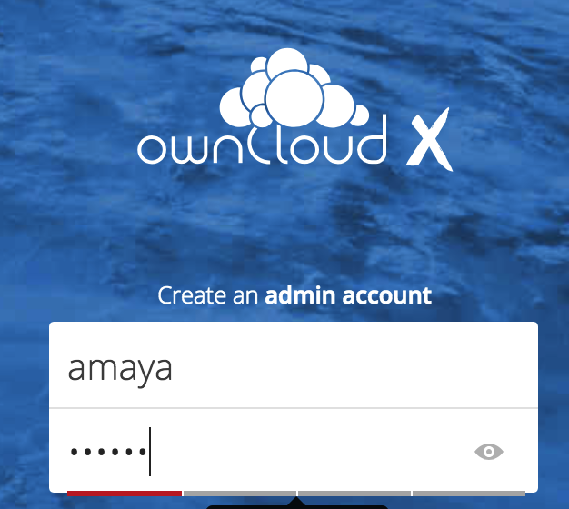

Right after login, you will be redirected to your home folder (default), which is already pre populated.

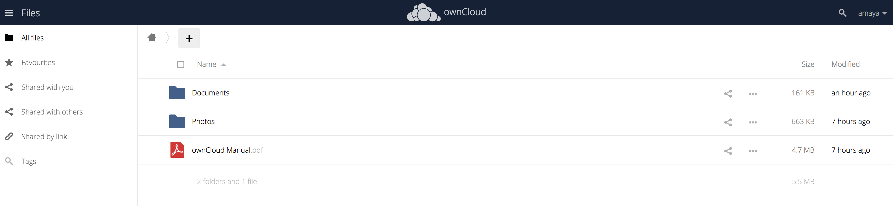

Per default, this data lives on the data directory of ownCloud, and under your username, in this case `/var/www/html/owncloud/data/amaya/`.

## Basic ownCloud administration

This document is intented to be a quick installation and getting started guide for ownCloud on RHEL 7, however some very basic tips on administation are to be covered.

### User creation

To create a user, log in with your admin user (in this case, amaya) and go to the upper right corner, and click on your user name, you will see the following menu appearing:

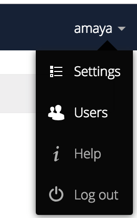

Click on users, and you will be redirected to the users management screen. 

Adding a user is as simple as filling the fields on the top of the screen, and chosing the group or groups he will belong to.

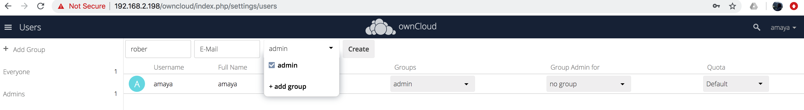

Once the user has been added, you will be able to see the list of users (as you are the admin) available in the system:

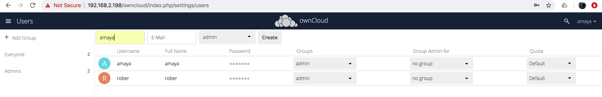

And you will be able to log with any of them.

### Port Management

We could decide to run the ownCloud in another port (for instance, 8080), it's a matter of a simple line on the Apache config file, `/opt/rh/httpd24/root/etc/httpd/conf/httpd.conf`

~~~~
Listen 192.168.2.198:8080
~~~~

I have opted for this, as this machine has different network interfaces, and I just want that one IP serves http requests on the 8080 port. If you want to use "all interfaces" or you only have one interface, you can just use:

~~~~
Listen 192.168.2.198:80
~~~~

Now, you have to point your browser to `http://192.168.2.198:8080/owncloud` instead, as follows:

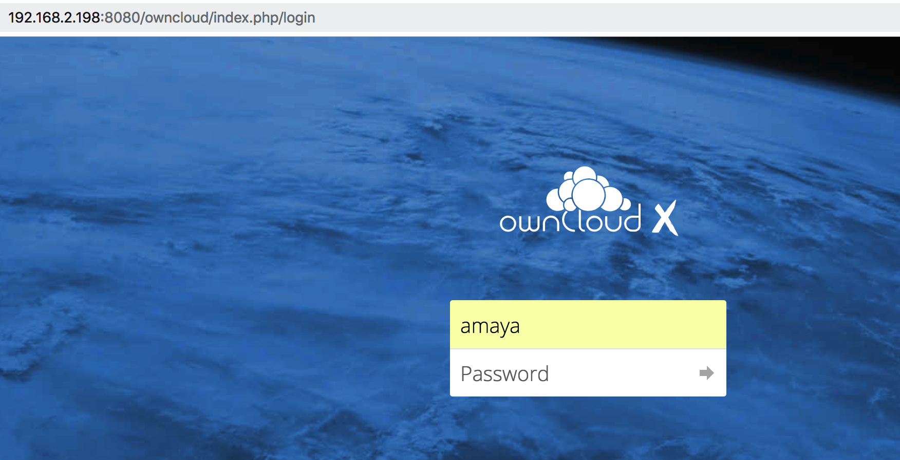

**NOTE:** ownCloud will redirect you to the php needed page.

## Accessing with the client

To access using a client app of your choice (different Linux flavors, Windows, Mac, iOS, Android), you need to download it from ownCloud site, or from the server's web interface. The first time you log in, you are presented with the following screen:

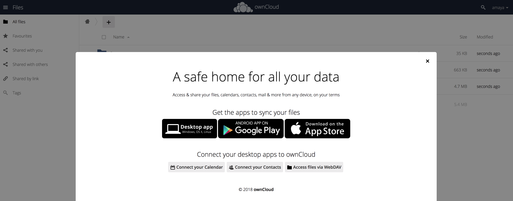

**NOTE:** The client installation is out of the scope of this document, but is pretty easy.

**NOTE:** The client used in this guide is the one for MacOS X Mojave.

The first screen you are presented with, is the connection screen, you have to enter the IP / URL of your ownCloud server and also the name of the service (in this case I have not configured a virtual server, but a directory). 

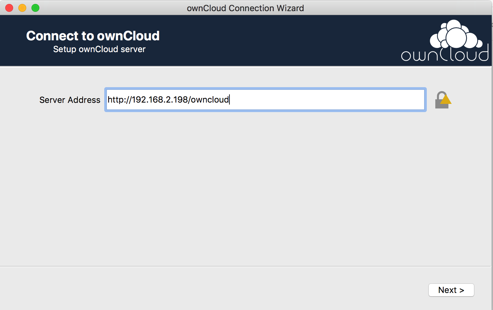

After that screen, you are asked for your user credentials (name and password) in the ownCloud server:

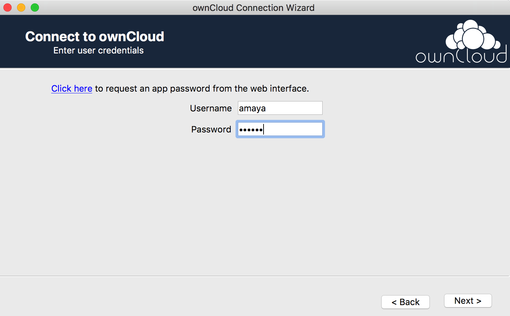

And finally, you are given the option on what and how to sync from your ownCloud folder to your local one (in your personal computer).

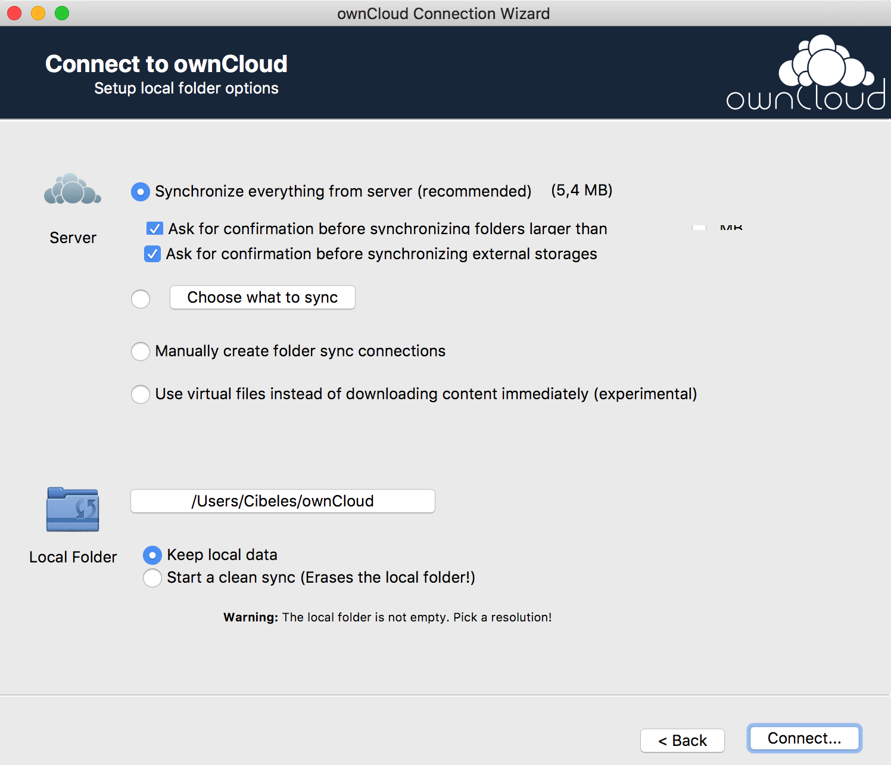

Once the connection is completed, you are presented with the items that are syncronized for the first time (default data stored on your local default ownCloud folder).

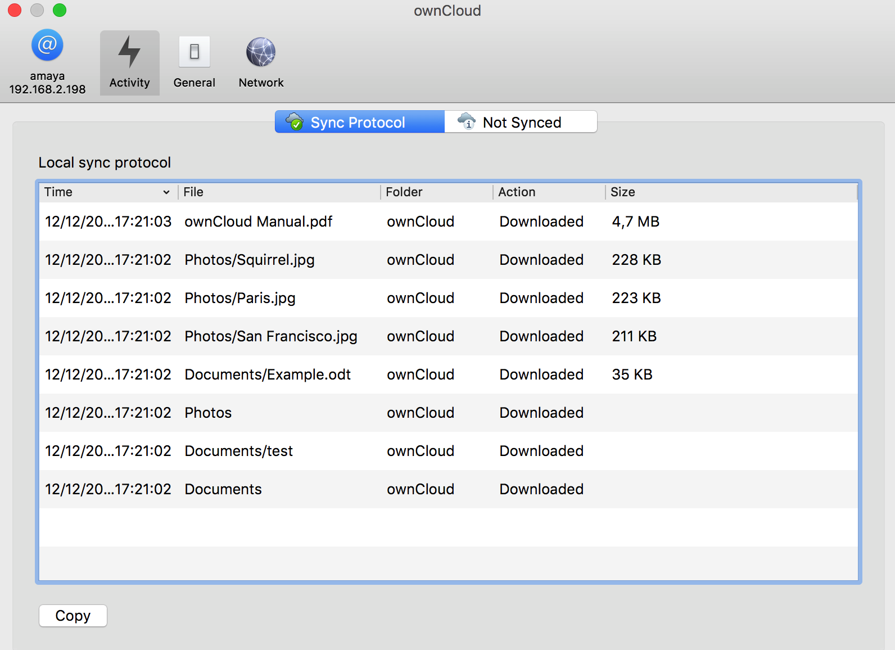

Now, let's test the creation of a new folder and file on the server and see how it synchonizes on the client.

Again, go to your ownCloud web interface at `http://192.168.2.198/owncloud` and log in with your user (in this case, amaya).

Click on "All files" and then on the "+" sign, to add a folder (test):

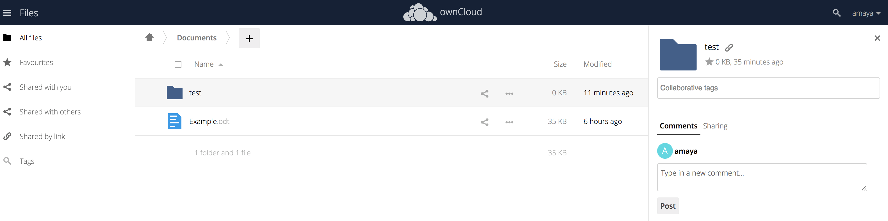

Click on "test" folder and simply drag a file:

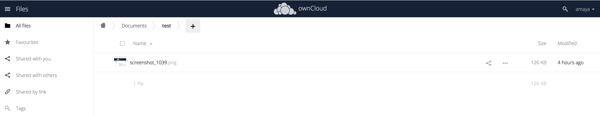

You can also verify the data is indeed in the ownCloud server, looking into the data folder:

~~~~
[root@ansible-master test]# pwd
/var/www/html/owncloud/data/amaya/files/Documents/test
[root@ansible-master test]# ll
total 128
-rw-r--r--. 1 apache apache 128913 dic 12 13:25 screenshot_1039.png
~~~~

And finally, let's verify it's also on the client, from the Activity tab on the client app, just see the list of files, double click on the newly created one, and the finder will pop up showing you the file on your computer and the path to it.

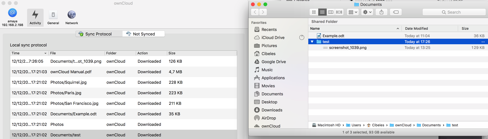
